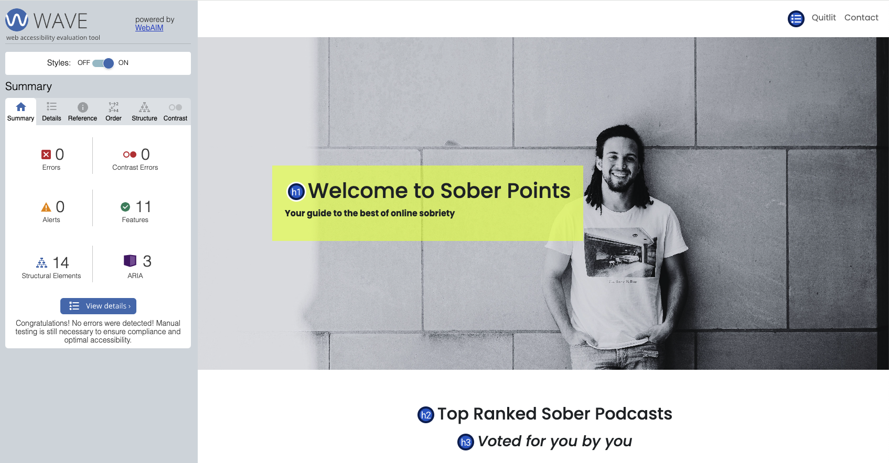
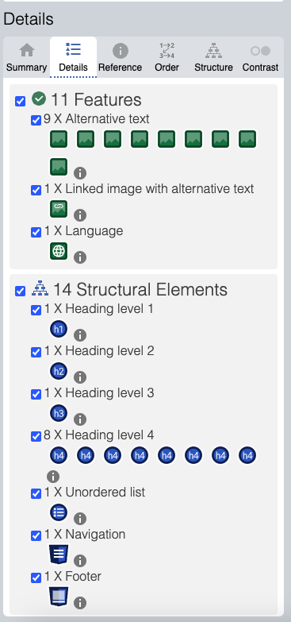
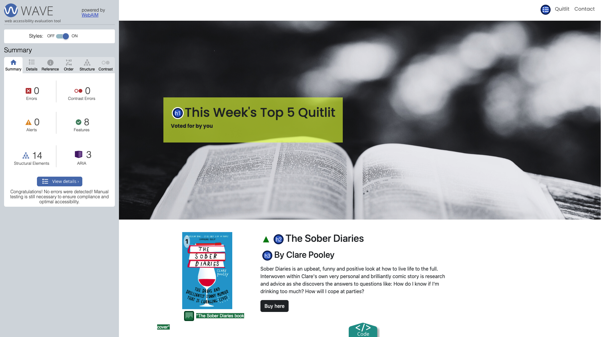

# Sober Points

## Table of Contents
- [Introduction](#introduction)
- [Technologies Used](#technologies-used)
- [Features](#features)
- [Project Structure](#project-structure)
- [Installation and Setup](#installation-and-setup)
- [Deployment](#deployment)
- [Attribution](#attribution)


## Introduction
**Sober Points** is a static front-end website designed to help people on their journey to sobriety. The website serves as a resource hub, providing recommendations for **Quitlit** books and podcasts to aid in the recovery process. It is designed to be simple, accessible, and fully responsive, ensuring users have a seamless experience whether they're browsing on a mobile device or desktop.

The website features:
- A **Home** page with an introduction to the site and a list of this week's top-rated podcasts.
- A **Quitlit** page that lists recommended books about sobriety and personal transformation. 
- A **Contact** page with a way for users to get in touch.

The site uses **HTML5**, **CSS3**, and **Bootstrap** for responsive layout and styling.

## Technologies Used
- **HTML5**: Structuring the website and content.
- **CSS3**: For styling and layout.
- **Bootstrap**: A front-end framework used for responsive design and grid layout.
- **Google Fonts**: I used fonts **Poppins**, and **Roboto** to ensure good typography and readability. These specific fonts were chosen for their clean, modern aesthetic. 

## Why I Used Bootstrap 
I chose to use Bootstrap for its grid system and responsive design components, ensuring that the site is mobile-friendly and looks great across various screen sizes.

## Features
- **Multi-page website** with three key sections: Home, Quitlit, and Contact.
- **Responsive layout** ensuring compatibility with both mobile and desktop devices.
- **Hero section** on the Home page introducing the website and its mission.
- A **Quitlit page** showcasing top-rated sobriety-related books, with links to buy each book.
- A **Podcast Grid** on the Home page that features top-ranked sobriety podcasts, including direct links to listen on Spotify.
- A **Contact page** where users can reach out for more support and information.
- **Interactive cards** for podcasts and books, providing users with easy-to-click buttons for further engagement (e.g., Listen on Spotify, Buy Books).

## Project Structure
The project is structured as follows:

### Files and Folders:
- **index.html**: The **Home page** of the website. This page introduces the website and includes a featured list of podcasts and resources.
- **quitlit.html**: The **Quitlit page** where users can explore top-rated sobriety-related books, each with descriptions and links to purchase them.
- **contact.html**: The **Contact page** offering users a way to get in touch with the creators of Sober Points for additional information, suggestions or support.
- **assets/**
  - **images/**: Contains all the image files (e.g., book covers, podcast images, logos).
    - `sober-diaries.jpg`: Image for "The Sober Diaries" book.
    - `unexpected-joy.jpg`: Image for "The Unexpected Joy of Being Sober" book.
    - `glorious-rock.jpg`: Image for "Glorious Rock Bottom" book.
    - `we-are-luckiest.jpg`: Image for "We Are the Luckiest" book.
    - `naked-mind.jpg`: Image for "This Naked Mind" book.
    - `1sober-points-logo.jpg`: Logo used in the navigation.
    - `sober-points-logo.png`: Logo used in the footer.
    - **Podcast Images**:
        - `sober-awkward.jpg`: Image for "Sober Awkward" podcast.
        - `ttias.webp`: Image for "They Think It's All Sober" podcast.
        - `sober-dave.jpeg`: Image for "One For the Road" podcast.
        - `tnm.png`: Image for "This Naked Mind" podcast.
        - `sgg.jpg`: Image for "A Sober Girl's Guide" podcast.
        - `sp.jpeg`: Image for "Sober Powered" podcast.
        - `sober-stories.jpg`: Image for "Sober Stories" podcast.
        - `oti.jpg`: Image for "OTI" podcast.
  - **css/**: Custom styles for the website's look and feel.
  - **bs/**: Includes JavaScript or Bootstrap scripts for interactive elements.

  # Accessibility

To make the site as accessible as possible, the following principles and features have been implemented:

## Semantic HTML
Proper HTML tags (e.g., `<header>`, `<footer>`, `<section>`, `<nav>`) are used to create a logical structure and improve readability for screen readers.

## Alternative Text for Images
All images, including book covers, podcast logos, and background images, include descriptive alt text to ensure that screen readers can convey meaningful information to visually impaired users.

## Keyboard Accessibility
The website is fully navigable using the keyboard, with clear tab order and focus states. Users can easily navigate between interactive elements like buttons, links, and form fields using the Tab key.

## Color Contrast
High contrast between text and background colors is maintained to ensure readability for users with low vision or color blindness. For example, the text color contrasts well with the background color in sections like the hero banner.

## Responsive Design
The site is designed to be fully responsive, ensuring that it works well on both mobile and desktop devices. This ensures that the site is usable across a variety of devices, which is essential for users with mobility impairments who may rely on adaptive devices.

## ARIA (Accessible Rich Internet Applications) Attributes
Where necessary, ARIA labels and roles are added to improve the accessibility of dynamic elements like buttons and navigation menus.

## Forms and Labels
All form fields have clear and labels to ensure that they are understandable for screen readers. 

## Wave Chrome Accessibility Tool 
The WAVE Web Accessibility Evaluation Tool is a free browser extension that helps identify and fix accessibility issues on web pages. It's developed by WebAIM.org and can be added to Google Chrome.

Sober Points has passed all checks using the Wave accessibility tool on chrome. Here is a screen shot of the homepage results.


### Quitlit page



  
## Installation and Setup
To set up the project locally, follow these steps:

1. Clone the repository:
    ```bash
    git clone https://github.com/shipleyux/milestone-1.git
    ```
2. Open the project folder in your preferred code editor or file browser.
3. Open `index.html`, `quitlit.html`, or `contact.html` in your browser to view the respective pages.


- If you're using **Bootstrap**, the necessary CDN links are included in the `<head>` section of the HTML files.
- Google Fonts are included for custom typography.

## Deployment
The project is deployed on **GitHub Pages** and can be accessed at:  
REMEMBER TO FILL THIS IN!

To deploy the project:
1. Push your project to GitHub.
2. In your repository, go to "Settings" > "Pages."
3. Under **Source**, select the **main branch** and **root folder** for deployment.

Once deployed, your site will be live at the GitHub Pages URL.

## Attribution
- **Images**: All book cover images and podcast logos are sourced from external media on podcast and book websites. Hero images are sourced from Unsplash and Pixabay.
- **Bootstrap**: Bootstrap is used for responsive design. The relevant attribution is included in the code.
- **Google Fonts**: Custom fonts **Poppins**, and **Roboto** are used for better typography, sourced from [Google Fonts](https://fonts.google.com).


